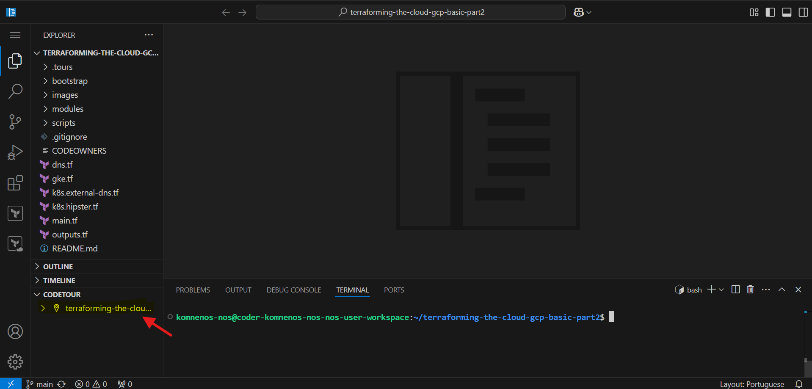

# terraforming the cloud - part 2

- version 2025-01-13

![Terraforming the cloud architecture][tfc-arch]

Temas abordados neste modulo:

- Criação de [modulos de Terraform](https://www.terraform.io/docs/language/modules/syntax.html)
- Criação de [cluster GKE](https://registry.terraform.io/providers/hashicorp/google/latest/docs/resources/container_cluster)
- Criação de [zonas de DNS](https://registry.terraform.io/providers/hashicorp/google/latest/docs/resources/dns_managed_zone)
- Utilização de diferentes providers ([kubectl provider](https://registry.terraform.io/providers/alekc/kubectl/latest/docs))
- [Templates de ficheiros](https://registry.terraform.io/providers/hashicorp/template/latest/docs/data-sources/file)

## iniciar o tutorial (setup automatico)

[](https://ssh.cloud.google.com/cloudshell/open?cloudshell_git_repo=https://github.com/tentwentyone/terraforming-the-cloud-gcp-basic-part2&cloudshell_tutorial=tutorial.md)

### erro a abrir o tutorial

Se por acaso tiverem este erro:

![tfc-cloushell-error-reserved-id]

Devem fechar o tutorial:

![tfc-cloushell-error-open-tutorial]

E depois na cloudshell vamos reinicar o tutorial usando o seguinte comando:

```bash
teachme tutorial.md
```

---

## setup do ambiente (manual)

Esta secção explica como preparar o IDE para poderem executar os comandos do tutorial.

Abaixo seguem dois guias para configuração em:

1. Google Cloud Shell
2. Visual Studio Code

### configurar a cloud shell

Abrir o endereço <https://console.cloud.google.com> e autenticar.

De seguida, ativar a cloud shell:

![tfc-cloudshell-activate]

Abrir em nova janela:

![tfc-cloushell-open-new]

Abrir editor:

![tfc-cloushell-open-editor]

Fechar a janela do terminal no fundo:

![tfc-cloushell-close-terminal]

Abrir novo terminal (embebido no editor):

![tfc-cloushell-new-terminal]

Clonar o projeto:

```bash
git clone https://github.com/tentwentyone/terraforming-the-cloud-gcp-basic-part2.git && cd terraforming-the-cloud-gcp-basic-part2
```

Abrir o editor na pasta do projeto:

![tfc-cloushell-open-folder]

E agora que têm o editor pronto, podemos autenticar a consola com o GCP:

```bash
gcloud config set project <project-id> &&
gcloud config set accessibility/screen_reader false
```

## Pré-Config Vscode
<!-- markdownlint-disable MD033 -->
<details>

<summary>Clicar para expandir</summary>
<!-- markdownlint-enable MD033 -->

Para iniciares o workshop terás de aceder ao teu workspace no Coder.

Será facultado um link assim como username e password para que possas fazer o login. Ao chegares a esta página utiliza as credenciais para entrares na plataforma.


Ao fazerem o login deverão encontrar um workspace já criado para o propósito do workshop semelhante a este:


⚠️ Não criem um novo workspace.

Ao acederem ao vosso workspace vão conseguir ver se este já se encontra disponível e se tal se verificar podem aceder ao `code-server`


</details>

## Configurar o vscodeserver
<!-- markdownlint-disable MD033 -->
<details>

<summary>Clicar para expandir</summary>
<!-- markdownlint-enable MD033 -->

Abre o terminal no vscode com o comando:

```bash
ctrl+ç
```

ou se estiveres num mac:

```bash
shift+cmd+c
```

Faz git clone do repositório:

```bash
git clone https://github.com/tentwentyone/terraforming-the-cloud-gcp-basic-part2.git
```

Abre a diretoria com o comando:

```bash
ctrl+k+ctrl+o
```

ou se estiveres num mac:

```bash
cmd+k+cmd+o
```

Abre a diretoria do projecto:

```bash
cd terraforming-the-cloud-gcp-basic-part2/
```

Seleciona o path para o codetour:

```bash
/home/coder/terraforming-the-cloud-gcp-basic-part2
```

Inicia o tour no canto inferior esquerdo do teu Visual Studio Code:



</details>

## Comandos úteis

```bash
# obter a lista de machine-types
gcloud compute machine-types list --zones=europe-west1-b --sort-by CPUS

# listar a lista de regioes disponiveis
gcloud compute regions list

# listar as zonas disponiveis para uma dada regiao
gcloud compute zones list | grep europe-west1

# listar network-endpoints
gcloud compute network-endpoint-groups list

# apagar network-endpoints
gcloud compute network-endpoint-groups delete <id>

# delete multiple negs at once
gcloud compute network-endpoint-groups delete $(gcloud compute network-endpoint-groups list --format="value(name)")

# verificar as versoes dos release channels
gcloud container get-server-config --format "yaml(channels)" --zone europe-west1-b
```
<!-- markdownlint-disable-file MD013 -->

 [//]: # (*****************************)
 [//]: # (INSERT IMAGE REFERENCES BELOW)
 [//]: # (*****************************)

[tfc-arch]: https://github.com/tentwentyone/terraforming-the-cloud-gcp-basic-part2/raw/main/images/terraforming-the-cloud.png "Terraforming the cloud architecture"

[tfc-cloudshell-activate]: https://github.com/tentwentyone/terraforming-the-cloud-gcp-basic-part2/raw/main/images/cloudshell-activate.png "Cloudshell activate screenshot"

[tfc-cloushell-open-new]: https://github.com/tentwentyone/terraforming-the-cloud-gcp-basic-part2/raw/main/images/cloudshell-open-new.png "Cloudshell open new window screenshot"

[tfc-cloushell-open-editor]: https://github.com/tentwentyone/terraforming-the-cloud-gcp-basic-part2/raw/main/images/cloudshell-open-editor.png "Cloudshell open editor screenshot"

[tfc-cloushell-close-terminal]: https://github.com/tentwentyone/terraforming-the-cloud-gcp-basic-part2/raw/main/images/cloudshell-close-terminal.png "Cloudshell close terminal window screenshot"

[tfc-cloushell-new-terminal]: https://github.com/tentwentyone/terraforming-the-cloud-gcp-basic-part2/raw/main/images/cloudshell-new-terminal.png "Cloudshell new terminal window screenshot"

[tfc-cloushell-open-folder]: https://github.com/tentwentyone/terraforming-the-cloud-gcp-basic-part2/raw/main/images/cloudshell-open-folder.png "Cloudshell open folder screenshot"

[tfc-cloushell-error-reserved-id]: https://github.com/tentwentyone/terraforming-the-cloud-gcp-basic-part2/raw/main/images/cloudshell-open-error-reserved-id.jpg "Cloudshell error reserved-id"

[tfc-cloushell-error-open-tutorial]: https://github.com/tentwentyone/terraforming-the-cloud-gcp-basic-part2/raw/main/images/cloudshell-open-error-close-tutorial.jpg "Cloudshell error open tuturial"
